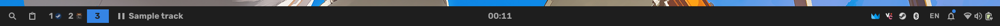
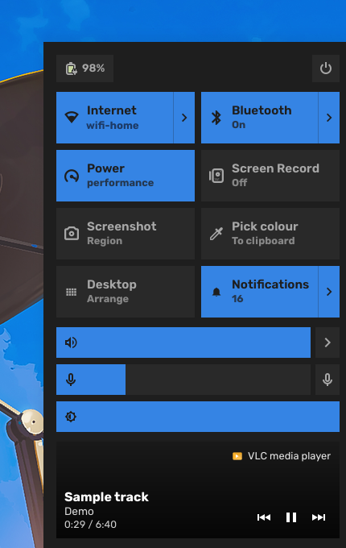
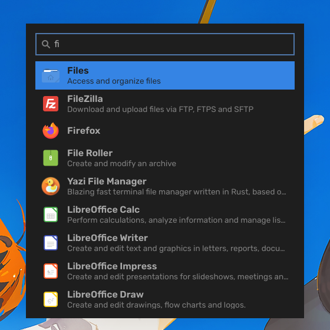
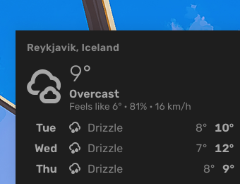

# Manifold

Desktop shell для [niri](https://github.com/YaLTeR/niri) на AGS v3 (Astal) и
GTK4, оформленный в духе GNOME/Adwaita. Состояние композитора берётся напрямую
из niri IPC — Hyprland-специфичных зависимостей нет.



<p align="center">
  
  
  
</p>


## Установка

Нужны **niri** (шелл читает `$NIRI_SOCKET`) и **Nix** с flakes.

Попробовать поверх текущей сессии, из клона репозитория:

```bash
nix run .
```

Остановить — `Ctrl+C` или `manifold quit`.

Постоянно — через Home Manager:

```nix
{
  inputs.manifold = {
    url = "github:cublae/Manifold";
    inputs.nixpkgs.follows = "nixpkgs";
  };

  # в конфигурации home-manager:
  imports = [ inputs.manifold.homeManagerModules.default ];

  programs.manifold.enable = true;
}
```

Модуль ставит пакет, генерирует `~/.config/manifold/config.json` из опций и
заводит systemd-юзер-сервис, привязанный к `graphical-session.target`.

`inputs.nixpkgs.follows` важен: без него в системе окажутся две сборки gtk4 и
libadwaita. Сборке нужны `pkgs.astal` и `pkgs.ags`, то есть достаточно свежий
nixpkgs; на stable-ветке `follows` придётся убрать.

### Запуск без systemd, из автостарта niri

По умолчанию модуль заводит systemd-юзер-сервис. Запуск можно отдать вместо
этого самому niri — как именно, зависит от того, чем у вас сделан его конфиг.

**Конфиг niri пишется руками** (`~/.config/niri/config.kdl`) — самый частый
случай, в том числе когда сам композитор включён на системном уровне через
`programs.niri.enable`. Выключите сервис в home-manager:

```nix
programs.manifold = {
  enable = true;
  systemd.enable = false;
};
```

и добавьте строку в `config.kdl`:

```kdl
spawn-at-startup "manifold"
```

Искать бинарь по имени достаточно: home-manager кладёт пакет в профиль, а niri
передаёт детям свой `PATH` вместе с `NIRI_SOCKET` и `WAYLAND_DISPLAY` — больше
шеллу ничего не нужно. Если забыть про эту строку, home-manager при сборке
предупредит, что шелл никто не запускает.

**Конфиг niri генерируется home-manager** (импортирован модуль `programs.niri`)
— тогда строку впишет сам модуль:

```nix
programs.manifold = {
  enable = true;
  systemd.enable = false;
  niri.spawnAtStartup = true;
};
```

Включать `niri.spawnAtStartup` без импортированного модуля niri нельзя — сборка
остановится с объяснением, а не молча ничего не сделает.

Чем при этом жертвуете: systemd-сервис перезапускает шелл, если тот упал, и
упорядочивает его относительно `graphical-session.target`. Из автостарта niri
падение означает сессию без панели до следующего входа.

Готовый пример настройки:

```nix
programs.manifold = {
  enable = true;

  bar = {
    position = "bottom";
    size = 38;
    modules = {
      start = [ "launcher" "clipboard" "workspaces" "media" ];
      center = [ "clock" ];
      end = [ "privacy" "screencast" "recording" "tray" "keyboard-layout" "notifications" "system-indicators" ];
    };
    outputs."DP-2".end = [ "tray" "system-indicators" ];
  };

  workspaces.showIcons = true;
  clock.format = "%H:%M";
  notifications.position = "auto";
  theme = {
    mode = "auto";
    accent = "#3584e4";
    radius = 12;
  };

  # для ключей без отдельной опции
  settings.clipboard.maxEntries = 500;
};
```

### Горячие клавиши

Второй запуск бинарника не поднимает второй шелл, а передаёт команду
работающему — поэтому биндится он напрямую, без обёрток:

```bash
manifold toggle launcher            # ещё: clipboard, calendar, control-center,
                                    #      notification-center и weather — последний
                                    #      есть, только если задано место
manifold control-center wifi        # сразу на нужной странице: wifi, bluetooth, mixer, session
manifold pick-color                 # пипетка: hex уходит в буфер
manifold desktop edit               # правка виджетов рабочего стола; ещё on и off
manifold reload                     # перечитать конфиг
manifold quit
```

Часть из этого есть и в интерфейсе — пипетка и правка виджетов лежат плитками в
центре управления, — но на клавишу вешается только так.

Для конфига niri:

```kdl
binds {
    Mod+Space { spawn "manifold" "toggle" "launcher"; }
    Mod+V     { spawn "manifold" "toggle" "clipboard"; }
    Mod+N     { spawn "manifold" "toggle" "control-center"; }
    Mod+P     { spawn "manifold" "pick-color"; }
}
```

## Настройка

Две формы одного и того же. Опции Home Manager `programs.manifold.*` собираются
в `~/.config/manifold/config.json` — тот же файл можно писать руками, если
Home Manager не используется. Указывать нужно только то, что отличается от
умолчаний; файл отслеживается, правки применяются без перезапуска, а битый JSON
не роняет шелл — он логируется, и берутся умолчания.

Полный конфиг со всеми значениями по умолчанию:

```json
{
  "bar": {
    "enabled": true,
    "position": "bottom",
    "size": 38,
    "onAllMonitors": true,
    "modules": {
      "start": ["launcher", "clipboard", "workspaces", "media"],
      "center": ["clock"],
      "end": ["privacy", "screencast", "recording", "tray", "keyboard-layout", "notifications", "system-indicators"]
    },
    "outputs": {}
  },
  "workspaces": {
    "perMonitor": true,
    "showEmpty": false,
    "labels": "index",
    "showIcons": true,
    "maxIcons": 4
  },
  "clock": {
    "format": "%H:%M",
    "tooltipFormat": "%A, %e %B %Y",
    "verticalFormat": "%H\n%M"
  },
  "calendar": { "firstDay": "monday" },
  "interface": { "language": "auto" },
  "desktop": {
    "enabled": false,
    "clockFormat": "%H:%M",
    "dateFormat": "%A, %e %B",
    "showDate": true,
    "showMedia": true
  },
  "weather": {
    "location": "",
    "latitude": 0,
    "longitude": 0,
    "units": "metric",
    "interval": 30
  },
  "media": { "maxLength": 24 },
  "resources": {
    "interval": 2000,
    "showCpu": true,
    "showMemory": true,
    "showTemperature": true
  },
  "focusedWindow": { "maxLength": 48, "showAppId": false },
  "notifications": {
    "timeout": 5,
    "position": "auto",
    "maxPopups": 3,
    "doNotDisturb": false
  },
  "launcher": { "minScore": 0.2, "showHidden": false },
  "osd": { "timeout": 1500, "position": "bottom", "barRadius": 0 },
  "audio": { "maxVolume": 1 },
  "animations": { "enabled": true, "duration": 180 },
  "clipboard": {
    "manageDaemon": true,
    "maxEntries": 200,
    "maxVisible": 20,
    "persist": true
  },
  "screenRecord": {
    "target": "portal",
    "fps": 60,
    "audio": "default_output",
    "directory": ""
  },
  "theme": {
    "mode": "auto",
    "accent": "#3584e4",
    "accentFromWallpaper": false,
    "wallpaper": "",
    "radius": null,
    "transition": 250,
    "spacing": 6,
    "opacity": 1,
    "font": ""
  },
  "modules": {
    "controlCenter": true,
    "notifications": true,
    "launcher": true,
    "clipboard": true,
    "osd": true
  }
}
```

### Панель

| Ключ конфига | Опция Home Manager | По умолчанию | Что делает |
| --- | --- | --- | --- |
| `bar.enabled` | `bar.enable` | `true` | Показывать панель |
| `bar.position` | `bar.position` | `"bottom"` | Край экрана: `top`, `bottom`, `left`, `right`. На боковой панели модули стоят вертикально, а часы переходят на `clock.verticalFormat` |
| `bar.size` | `bar.size` | `38` | Толщина в логических пикселях: высота у горизонтальной, ширина у вертикальной |
| `bar.onAllMonitors` | `bar.onAllMonitors` | `true` | Панель на каждом мониторе, а не только на первом |
| `bar.modules.start` | `bar.modules.start` | `["launcher", "clipboard", "workspaces", "media"]` | Модули начальной секции, по порядку |
| `bar.modules.center` | `bar.modules.center` | `["clock"]` | Модули центральной секции |
| `bar.modules.end` | `bar.modules.end` | `["privacy", "screencast", "recording", "tray", "keyboard-layout", "notifications", "system-indicators"]` | Модули конечной секции |
| `bar.outputs.<имя>.{start,center,end}` | `bar.outputs.<имя>.{start,center,end}` | `{}` | Раскладка для конкретного монитора. Ключ — имя коннектора из `niri msg outputs`. Секции, которых нет, берутся из `bar.modules`; несуществующее имя просто ни с чем не совпадёт |

Значения в списках модулей:

| Модуль | Что делает |
| --- | --- |
| `workspaces` | Воркспейсы niri с иконками окон, клик и колесо переключают |
| `focused-window` | Заголовок активного окна (на боковой панели — иконка) |
| `clock` | Часы, клик открывает календарь |
| `keyboard-layout` | Текущая раскладка, клик переключает |
| `tray` | Системный трей, ПКМ открывает меню приложения |
| `notifications` | Колокольчик с точкой непрочитанного, клик открывает центр |
| `system-indicators` | Сеть, звук, батарея; клик открывает центр управления |
| `media` | Что играет: название, клик — пауза, колесо — переключение трека |
| `recording` | Виден только во время записи экрана: таймер, клик — стоп |
| `screencast` | Виден, только когда кто-то захватывает экран (звонок, OBS, портал). Источник — сам композитор, а не список процессов |
| `privacy` | Виден, только когда занят микрофон или камера; в подсказке — кто именно |
| `resources` | CPU, память и температура из `/proc` и hwmon |
| `weather` | Температура и облачность; клик открывает прогноз. Нужны координаты в `weather.latitude`/`longitude`, без них модуль не строится |
| `launcher` | Кнопка лаунчера |
| `clipboard` | Кнопка истории буфера |
| `control-center` | Отдельная кнопка центра управления |
| `spacer` | Распорка внутри секции |

### Воркспейсы, часы, календарь

| Ключ конфига | Опция Home Manager | По умолчанию | Что делает |
| --- | --- | --- | --- |
| `workspaces.perMonitor` | `workspaces.perMonitor` | `true` | Показывать только воркспейсы того монитора, на котором панель |
| `workspaces.showEmpty` | `workspaces.showEmpty` | `false` | Показывать пустые воркспейсы. niri всегда держит один про запас, поэтому по умолчанию выключено; активный виден в любом случае |
| `workspaces.labels` | `workspaces.labels` | `"index"` | Подпись кнопки: `index`, `name` или `none` |
| `workspaces.showIcons` | `workspaces.showIcons` | `true` | Иконка на каждое окно воркспейса |
| `workspaces.maxIcons` | `workspaces.maxIcons` | `4` | Сколько иконок рисовать, прежде чем остальные отбрасываются |
| `clock.format` | `clock.format` | `"%H:%M"` | strftime для панели |
| `clock.tooltipFormat` | `clock.tooltipFormat` | `"%A, %e %B %Y"` | strftime для подсказки |
| `clock.verticalFormat` | `clock.verticalFormat` | `"%H\n%M"` | strftime для вертикальной панели; перевод строки учитывается |
| `calendar.firstDay` | `calendar.firstDay` | `"monday"` | С какого дня начинается сетка месяца: `monday` или `sunday`. Ни GLib, ни GTK не отдают ответ локали, поэтому это настройка, а не автоопределение |
| `interface.language` | `interface.language` | `"auto"` | Язык интерфейса шелла: `auto` (по локали), `en` или `ru`. Затрагивает только сам Manifold — имена приложений, тексты уведомлений и заголовки окон приходят уже написанными |
| `weather.location` | `weather.location` | `""` | Название места, например `Reykjavik`. Разово ищется через геокодер Open-Meteo, который отдаёт и координаты, и собственное имя места — иначе город показать неоткуда, forecast API имён не возвращает. `latitude`/`longitude`, если заданы, перебивают координаты, но имя всё равно берётся отсюда |
| `weather.latitude` | `weather.latitude` | `0` | Широта, для которой показывается погода. Умолчания и угадывания нет: определять по IP значит отдать адрес геосервису до того, как ты на это согласился, а по часовому поясу промахнёшься на пол-континента. Без координат модуль и его дропдаун вообще не строятся |
| `weather.longitude` | `weather.longitude` | `0` | Долгота |
| `weather.units` | `weather.units` | `"metric"` | `metric` — °C и км/ч, `imperial` — °F и mph |
| `weather.interval` | `weather.interval` | `30` | Минуты между запросами. Погода меняется небыстро, сервис бесплатный, так что редкий опрос и достаточен, и вежлив. Минимум 5 |
| `desktop.enabled` | `desktop.enable` | `false` | Виджеты на рабочем столе: крупные часы, дата и что играет. Они над обоями и под всеми окнами, и видны только пока на активном воркспейсе монитора нет окон — часы за полноэкранным редактором всё равно никто не увидит |
| `desktop.clockFormat` | `desktop.clockFormat` | `"%H:%M"` | strftime для крупных часов |
| `desktop.dateFormat` | `desktop.dateFormat` | `"%A, %e %B"` | strftime для строки под часами |
| `desktop.showDate` | `desktop.showDate` | `true` | Показывать дату под часами |
| `desktop.showMedia` | `desktop.showMedia` | `true` | Показывать, что играет, когда что-то играет |
| — | — | — | Расположение виджетов задаётся мышью, а не конфигом: плитка **Desktop** в центре управления (или `manifold desktop edit`) включает режим правки: виджеты перетаскиваются по сетке, колесо меняет размер, правый клик — выравнивание относительно точки сетки (по центру, влево, вправо). Позиции хранятся отдельно для каждого монитора в `~/.local/state/manifold/desktop-layout.json`. Escape или Enter выходит из режима |
| `focusedWindow.maxLength` | `focusedWindow.maxLength` | `48` | Обрезать заголовок после стольких символов; `0` — не обрезать |
| `focusedWindow.showAppId` | `focusedWindow.showAppId` | `false` | Показывать app id вместо заголовка |
| `media.maxLength` | `media.maxLength` | `24` | Длина названия трека в панели, в символах |
| `resources.interval` | `resources.interval` | `2000` | Миллисекунды между замерами |
| `resources.showCpu` | `resources.showCpu` | `true` | Показывать загрузку CPU |
| `resources.showMemory` | `resources.showMemory` | `true` | Показывать занятую память |
| `resources.showTemperature` | `resources.showTemperature` | `true` | Показывать температуру. Всё равно скрыто, если сенсора нет |

### Уведомления, OSD, звук, анимации

| Ключ конфига | Опция Home Manager | По умолчанию | Что делает |
| --- | --- | --- | --- |
| `notifications.timeout` | `notifications.timeout` | `5` | Секунды на экране. Критические ждут пользователя и это игнорируют |
| `notifications.position` | `notifications.position` | `"auto"` | Угол всплывающих карточек: `auto`, `top-right`, `top-left`, `top-center`, `bottom-right`, `bottom-left`, `bottom-center`. `auto` следует за баром |
| `notifications.maxPopups` | `notifications.maxPopups` | `3` | Сколько карточек на экране одновременно; остальные ждут в центре |
| `notifications.doNotDisturb` | `notifications.doNotDisturb` | `false` | Гасить всплывашки, не теряя сами уведомления |
| `osd.timeout` | `osd.timeout` | `1500` | Миллисекунды, сколько висит оверлей громкости/яркости |
| `osd.position` | `osd.position` | `"bottom"` | Где появляется: `bottom`, `top`, `center` |
| `osd.barRadius` | `osd.barRadius` | `0` | Скругление полоски уровня в пикселях; от половины высоты и выше получается пилюля |
| `audio.maxVolume` | `audio.maxVolume` | `1` | Потолок громкости, где `1` — 100%. PipeWire пускает до 150%, шелл следит за выходом по умолчанию и стягивает обратно |
| `animations.enabled` | `animations.enable` | `true` | Анимации панелей, уведомлений и страниц. Системный `gtk-enable-animations` всё равно главнее |
| `animations.duration` | `animations.duration` | `180` | Базовая длительность в миллисекундах |

### Лаунчер, буфер обмена, запись экрана

| Ключ конфига | Опция Home Manager | По умолчанию | Что делает |
| --- | --- | --- | --- |
| `launcher.minScore` | `launcher.minScore` | `0.2` | Минимальный балл нечёткого поиска, 0..1. Меньше — терпимее |
| `launcher.showHidden` | `launcher.showHidden` | `false` | Показывать записи с `NoDisplay` в `.desktop` |
| `clipboard.manageDaemon` | — (`settings`) | `true` | Поднимать `wl-paste --watch cliphist store` вместе с шеллом |
| `clipboard.maxEntries` | — (`settings`) | `200` | Глубина истории |
| `clipboard.maxVisible` | — (`settings`) | `20` | Сколько записей показывать до поиска |
| `clipboard.persist` | — (`settings`) | `true` | Хранить историю между запусками, в кеш-директории. Файл текстовый, то есть скопированное оказывается на диске читаемым. Работает только для встроенного запасного бэкенда на `wl-clipboard`: с cliphist история его собственная |
| `screenRecord.target` | — (`settings`) | `"portal"` | Что снимает gpu-screen-recorder: `portal`, `focused`, имя монитора или `region`. Без прямого доступа к DRM работает только `portal` |
| `screenRecord.fps` | — (`settings`) | `60` | Кадры в секунду |
| `screenRecord.audio` | — (`settings`) | `"default_output"` | Какое устройство подмешивать; пусто — тишина |
| `screenRecord.directory` | — (`settings`) | `""` | Куда писать записи; пусто — `~/Videos` |

### Тема

| Ключ конфига | Опция Home Manager | По умолчанию | Что делает |
| --- | --- | --- | --- |
| `theme.mode` | `theme.mode` | `"auto"` | `light`, `dark` или `auto` — за системной настройкой |
| `theme.accent` | `theme.accent` | `"#3584e4"` | Акцентный цвет, hex. Перекрывает акцент libadwaita только для поверхностей Manifold |
| `theme.accentFromWallpaper` | `theme.accentFromWallpaper` | `false` | Брать акцент из обоев вместо `accent`. Выбирается не самый большой по площади цвет, а самый заметный: крупнейшая область фотографии обычно небо или тень, и акцент из них не отличить от панели. С чёрно-белых обоев ничего не берётся, остаётся `accent` |
| `theme.wallpaper` | `theme.wallpaper` | `""` | Путь к обоям для `accentFromWallpaper`. Пусто — шелл ищет сам: waypaper пишет ответ в свой конфиг, swww можно спросить. Протокола для этого в Wayland нет и композитор обоями не владеет, поэтому для других программ путь нужно указать явно |
| `theme.radius` | `theme.radius` | `null` | Скругление углов панелей, лаунчера и контролов внутри них, в пикселях. `null` — брать у рабочего стола: правило `* { border-radius }` из `~/.config/gtk-4.0/gtk.css`, которое пишут туда генераторы тем, а если такого правила нет — квадратные углы. Отдельной опции GTK для скругления не существует, поэтому это единственный общесистемный источник. То, что задумано пилюлей (ползунки, точка непрочитанного), пилюлей и остаётся |
| `theme.transition` | `theme.transition` | `250` | Миллисекунды, на которые экран замирает при переключении светлой/тёмной темы. niri держит текущий кадр и потом плавно переводит его в новый, так что смена выглядит растворением, а не одновременным морганием всех окон. Задержка должна покрывать самое медленное приложение, а не только Manifold. `0` выключает |
| `theme.spacing` | `theme.spacing` | `6` | Базовый шаг отступов в пикселях; все паддинги кратны ему |
| `theme.opacity` | `theme.opacity` | `1` | Непрозрачность фона панелей, 0..1 |
| `theme.font` | `theme.font` | `""` | Шрифт; пусто — системный |

### Что вообще собирать

| Ключ конфига | Опция Home Manager | По умолчанию | Что делает |
| --- | --- | --- | --- |
| `modules.controlCenter` | `modules.controlCenter` | `true` | Центр управления |
| `modules.proxy` | `modules.proxy` | `true` | Плитка прокси в центре управления. Появляется только если установлен [MihomoManifold](https://github.com/cublae/mihomo-manifold): адрес и секрет контроллера ядра шелл берёт из его собственных настроек. Плитка переключает «по правилам ↔ напрямую», а по шеврону открывается выбор узла с проверкой задержки |
| `modules.notifications` | `modules.notifications` | `true` | Демон уведомлений, всплывашки и центр уведомлений. Имя на шине freedesktop может держать только один процесс — выключай, если уведомления обслуживает другой шелл |
| `modules.launcher` | `modules.launcher` | `true` | Лаунчер |
| `modules.clipboard` | — (`settings`) | `true` | История буфера |
| `modules.osd` | `modules.osd` | `true` | Оверлей громкости и яркости |

### Опции, которых нет в конфиге

Эти существуют только в Home Manager — они про то, как шелл ставится и
запускается, а не про его поведение:

| Опция | По умолчанию | Что делает |
| --- | --- | --- |
| `programs.manifold.enable` | `false` | Включить Manifold |
| `programs.manifold.package` | пакет из этого флейка | Какой пакет ставить |
| `programs.manifold.systemd.enable` | `true` | Запускать из systemd-юзер-сервиса, привязанного к `graphical-session.target`. Выключается ради автостарта niri — см. [раздел выше](#запуск-без-systemd-из-автостарта-niri) |
| `programs.manifold.niri.spawnAtStartup` | `false` | Добавить Manifold в `programs.niri.settings.spawn-at-startup`. Работает только с импортированным модулем niri, иначе сборка остановится с объяснением; для конфига, написанного руками, строка `spawn-at-startup "manifold"` пишется в `config.kdl` самостоятельно. systemd предпочтительнее: он перезапустит шелл после падения |
| `programs.manifold.settings` | `{}` | Произвольный JSON поверх сгенерированного конфига. Для ключей, у которых своей опции пока нет |

Источник правды по полям — [`src/config/schema.ts`](src/config/schema.ts), там
же комментарии к каждому.

## Лицензия

MIT, текст в [`LICENSE`](LICENSE).
